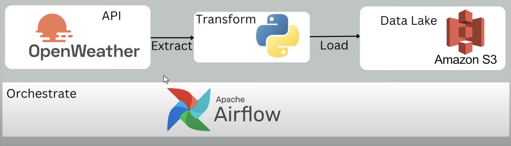
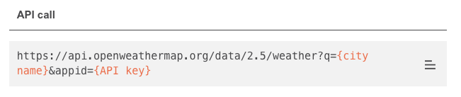
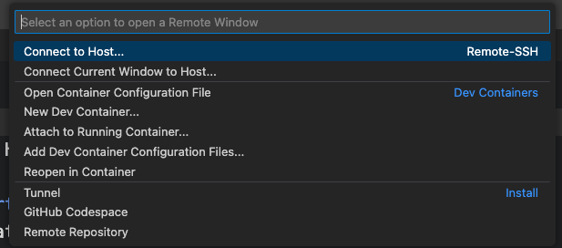
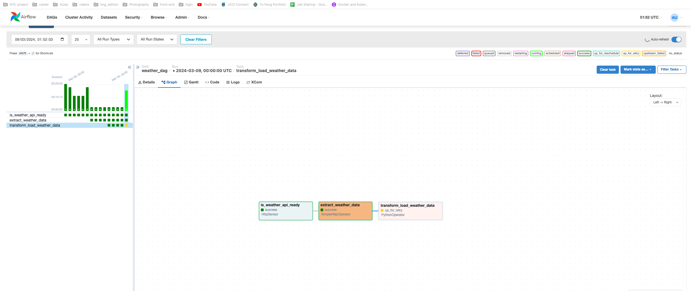
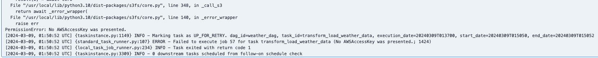
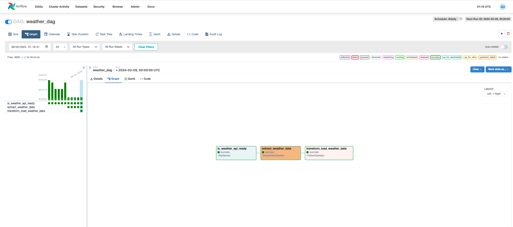
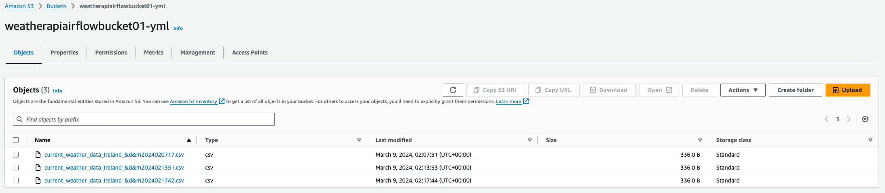

# Build and automate a python ETL pipeline with airflow on AWS EC2
[](https://skillicons.dev)

## Table of Contents
- [Introduction](#introduction)
- [Openweather API Key](#openai-api-key)
- [Install Dependencies On ec2](#install-dependencies-on-ec2)
- [Remotely SSH Visual Studio Code to AWS ec2](#remotely-SSH-visual-studio-code-to-AWS-ec2)
- [Create Dag](#create-dag)
- [Usage](#usage)


## [Introduction](#introduction) 
Apache Airflow is an open-source platform used for orchestrating and scheduling workflows of tasks and data pipelines.
In this repository, I will outline what I learned about how to build a Python ETL pipeline with airflow on AWS EC2.

The high-level architecture of this project is as below:



## [Openweather API Key](#openai-api-key)
Obtain an API key

1. Go to [Openweather platform](https://openweathermap.org/)
2. Sign in and click on `My API keys`, you'll see a key named default, make sure to copy it somewhere safe!
3. Go to API part, scroll down and find `Current & Forecast weather data collection`, click `API doc` inside `Current Weather Data`,
   find `Built-in API request by city name` part, then you'll see the API call as below:
   
   
   
5. Now you can move on to creating the AWS ec2 instance.


## [Install Dependencies On ec2](#install-dependencies-on-ec2)

Commands used when installing dependencies on ec2

1. For this part I will provide the command I used for the dependencies installation. Make sure you created an ec2 instance beforehand, having the security group and private key set up or created,
   make sure port 8080 is listened to, I used `t2.small` as instance type and `ubuntu` as OS, once you SSH your ec2, run the command below to install dependencies as needed:
   
Update and install packages:   
```
sudo apt update
```
```
sudo apt install python3-pip
```
```
sudo apt install python3.10-venv
```

Create a new virtual environment named airflow_venv:
```
python3 -m venv airflow_venv
```

Activate your virtual environment (Unix/macOS):
```
source airflow_venv/bin/activate
```

For Windows system, use the below command instead to activate:
```
.\airflow_venv\Scripts\activate.bat
```

Then install the necessary packages inside the virtual environment:
```
sudo pip install pandas
```
```
sudo pip install s3fs
```
```
sudo pip install apache-airflow
```
Lastly, you can run this command to run Apache Airflow in standalone mode:
```
airflow standalone
```
2. Go to your instance to copy your `Public IPv4 DNS` to your browser and add `:8080` at the end,
then you'll see this login page:


3. Use username and password shows in terminal to login your airflow account.


## [Remotely SSH Visual Studio Code to AWS ec2](#remotely-SSH-visual-studio-code-to-AWS-ec2)
How to remotely SSH (connect) Visual Studio Code to AWS EC2:

1. Click the button at the left bottom to open a remote window:


2. Connect host:


3. Once you get into the remote machine folder `Home/Ubuntu`, open the file `.ssh` inside your local user folder.

4. Edit your config file inside `.ssh`, which should follow this pattern:
```
Host your-instance-name
    Hostname Public-IPv4-address
    User ubuntu
    IdentifyFile your-key-pair-pem-path
```

## [Create Dag](#create-dag)
1. Make a Python file inside airflow folder, say `weather_dag.py` and make the necessary import.
```python
from airflow import DAG
from datetime import timedelta, datetime
from airflow.providers.http.sensors.http import HttpSensor
import json
from airflow.providers.http.operators.http import SimpleHttpOperator
from airflow.operators.python import PythonOperator
import pandas as pd

// DAG and Default Arguments
default_args = {
    'owner': 'airflow',
    'depends_on_past': False,
    'start_date': datetime(2023, 1, 8),
    'email': ['YOUR_EMAIL'],
    'email_on_failure': False,
    'email_on_retry': False,
    'retries': 2,
    'retry_delay': timedelta(minutes=2)
}

with DAG('weather_dag',
    default_args=default_args,
    schedule_interval = '@daily',
    catchup=False) as dag:

// Initialize express app
const app = express();
app.use(express.json());
app.use(cors());

// Define tasks as HttpSensor, SimpleHttpOperator and PythonOperator
is_weather_api_ready = HttpSensor(
    task_id ='is_weather_api_ready',
    http_conn_id='weathermap_api',
    endpoint='/data/2.5/weather?q=Ireland&APPID=YOUR_API'
    )


    extract_weather_data = SimpleHttpOperator(
    task_id = 'extract_weather_data',
    http_conn_id = 'weathermap_api',
    endpoint='/data/2.5/weather?q=Ireland&APPID=YOUR_API',
    method = 'GET',
    response_filter= lambda r: json.loads(r.text),
    log_response=True
    )

    transform_load_weather_data = PythonOperator(
    task_id= 'transform_load_weather_data',
    python_callable=transform_load_data
    )

// Declare Task Dependencies
    is_weather_api_ready >> extract_weather_data >> transform_load_weather_data

```
The weather API availability check must pass `is_weather_api_ready` before the weather data can be fetched `extract_weather_data`. 
Once the data is successfully fetched, it is then transformed and loaded `transform_load_weather_data`.

2. Then you'll see the Dag graph as below:


Since the operator `transform_load_weather_data` is not success, you can check the log to see what's going on:


As we can see, it shows PermissionError: No AWSAccessKey was presented.

3. Create AWS S3 bucket, then make sure to give your ec2 instance access to S3 bucket, you can go to
   `Security` -> `Modify IAM role` -> `Create IAM role` -> `AmazonEC2FullAccess` -> `AmazonS3FullAccess` -> `Update IAM role`

4. Update your S3 bucket name beside `to_csv` as a part of your csv file name:
```
df_data.to_csv(f"s3://s3-bucket-name-yml/{dt_string}.csv", index=False)
```

5. Go to your IAM Security credentials, and create an access key, store your Access Key and Secret access key to a safe place or download .csv file.

6. Open your terminal, make sure you activate the airflow virtual environment you created before.
```
sudo apt install awscli
aws configure
```
Then type in the access key and secret key you stored, your default region name etc.

You will see 2 new files generated under .aws, named `config` and `credentials`.

```
aws sts get-session-token
```
You will get credentials details in the terminal then, add them in your `aws_credentials` variable in your code:

```
aws_credentials = {"key": "your_access_key", "secret": "your_secret_access_key", "token": "your_token"}
```

Pass this new variable inside `to_csv`:

```
df_data.to_csv(f"s3://s3-bucket-name-yml/{dt_string}.csv", index=False, storage_options=aws_credentials)
```

Then, you'll see the graph status updated as below:
   

7. Now, you can go to S3 bucket to check, and you will see a new .csv file generated as below, once you triggered DAG more times, multiple .csv files will generate:
  

## [Usage](#usage)

### That's it 🌟! Now, you can automates the ETL (Extract, Transform, Load) process for weather data. 
### This workflow showcases Airflow's capability to orchestrate API data fetching, apply transformations in Python, and manage file storage operations. 
### This makes it a powerful tool for data engineering and automation tasks.
